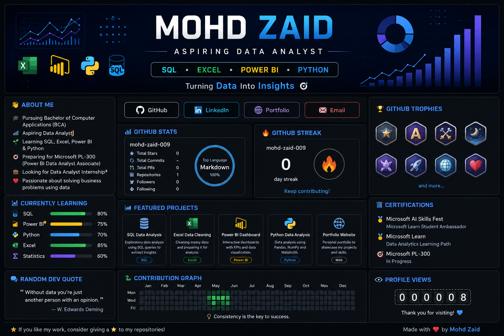

  

  

<h1 align="center">Hi 👋, I'm Mohd Zaid</h1>

  

<h3 align="center">📊 Aspiring Data Analyst | BCA Student | Microsoft Learn Learner</h3>

---

## 🚀 About Me

- 🎓 Pursuing **Bachelor of Computer Applications (BCA)**
- 📊 Aspiring **Data Analyst**
- 🌱 Currently learning **SQL, Excel, Power BI & Python**
- 🎯 Preparing for **Microsoft PL-300 Certification**
- 💼 Looking for **Data Analyst Internship**
- ❤️ Passionate about solving business problems using data

---

## 📚 Currently Learning

- 📊 Advanced SQL (Joins, CTEs, Window Functions)
- 📈 Power BI Dashboard Development
- 🐍 Python for Data Analysis (Pandas & NumPy)
- 📑 Excel Data Cleaning & Visualization

---
  
## 🛠️ Tech Stack

  

---

## 📈 GitHub Stats

---

## 🔥 GitHub Streak

---

## 🐍 Contribution Snake

  

---

## 🏆 GitHub Trophies

---

## 📂 Featured Projects

🚧 Coming Soon...

- 📊 SQL Sales Analysis
- 📈 Power BI Sales Dashboard
- 🧹 Excel Data Cleaning Project
- 🐍 Python Data Analysis
- 🌐 Personal Portfolio Website

---

## 📜 Certifications

- 🏅 Microsoft AI Skills Fest
- 🏅 Google Cybersecurity Professional Certificate

---

## 🌐 Connect With Me

---

## 👀 Profile Views

---

## 💡 Quote

> **"Turning raw data into meaningful insights, one project at a time."** 📊

⭐ Thanks for visiting my profile! ⭐

